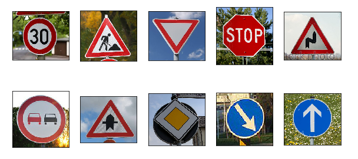
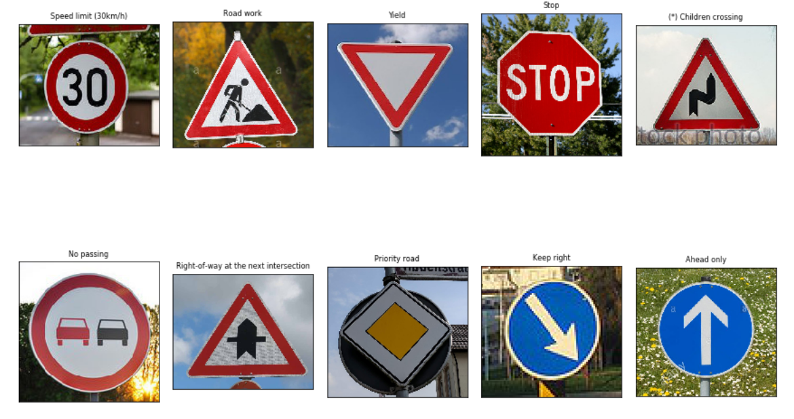
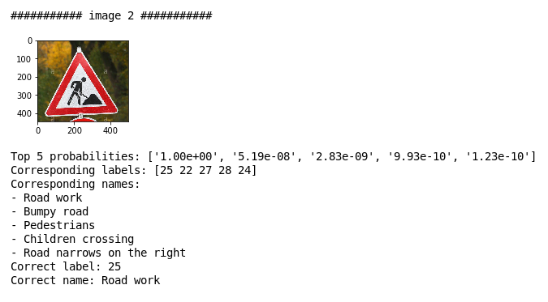

# **Traffic Sign Recognition Project** 

The goals / steps of this project are the following:

* Load the data set (see below for links to the project data set)
* Explore, summarize and visualize the data set
* Design, train and test a model architecture
* Use the model to make predictions on new images
* Analyze the softmax probabilities of the new images
* Summarize the results with a written report

[//]: # (Image References)

[image1]: ./examples/visualization.jpg "Visualization"
[image2]: ./examples/grayscale.jpg "Grayscaling"
[image3]: ./examples/random_noise.jpg "Random Noise"
[image4]: ./examples/placeholder.png "Traffic Sign 1"
[image5]: ./examples/placeholder.png "Traffic Sign 2"
[image6]: ./examples/placeholder.png "Traffic Sign 3"
[image7]: ./examples/placeholder.png "Traffic Sign 4"
[image8]: ./examples/placeholder.png "Traffic Sign 5"

## Rubric Points
### Here I will consider the [rubric points](https://review.udacity.com/#!/rubrics/481/view) individually and describe how I addressed each point in my implementation.  

---
### Writeup / README

#### 1. Provide a Writeup / README that includes all the rubric points and how you addressed each one. You can submit your writeup as markdown or pdf. You can use this template as a guide for writing the report. The submission includes the project code.

You're reading it! Please check the associated Ipython notebook 'Traffic_Sign_Classifier.ipynb' that contains all of the project code.

### Data Set Summary & Exploration

#### 1. Provide a basic summary of the data set. In the code, the analysis should be done using python, numpy and/or pandas methods rather than hardcoding results manually.

I used the numpy library to calculate summary statistics of the traffic
signs data set:

* The size of training set is: 34799
* The size of the validation set is: 4410
* The size of test set is: 12630
* The shape of a traffic sign image is: (32, 32, 3)
* The number of unique classes/labels in the data set is: 43

#### 2. Include an exploratory visualization of the dataset.

First, I showed some sample images from the training set, which is necessary to get a sense of how images look like:

I also included image samples from the test set in order to check out how similar they look to the training set:

Now, here is an exploratory visualization of the data set. It is a bar chart showing the distribution of classes (number of examples of each class) in the training set. Such a visualisation is important in order to check out whether the training set is balanced or skewed and help take later decisions in dataset augmentation (if needed) and training.

We notice that the training set is actually skewed. However, in the following, I decided to follow an Occam Razor approach; I trained using the skewed training set without trying to balance it. I suggested that if this gives me a satisfactory result it would be ok. Otherwise, I will go on and try to balance the dataset.

### Design and Test a Model Architecture

#### 1. Describe how you preprocessed the image data. What techniques were chosen and why did you choose these techniques? Consider including images showing the output of each preprocessing technique. Pre-processing refers to techniques such as converting to grayscale, normalization, etc. (OPTIONAL: As described in the "Stand Out Suggestions" part of the rubric, if you generated additional data for training, describe why you decided to generate additional data, how you generated the data, and provide example images of the additional data. Then describe the characteristics of the augmented training set like number of images in the set, number of images for each class, etc.)

I kept training image in RGB format since colors play a facilitating role in recognizing traffic signs.

As a last step, I normalized the image data to the interval [-1,+1] which is a convenient way to normalize image data that help improve training and convergence. Since image pixels before normalization have values in the interval [0,255]. The normalization formula I used is:

new_value = (old_value - 128) / 128

I also converted integer labels to one-hot vector formats which is necessary to use when working with convolutional neural networks. For that I used the `OneHotEncoder` class in python's `SciKit Learn` package.

#### 2. Describe what your final model architecture looks like including model type, layers, layer sizes, connectivity, etc.) Consider including a diagram and/or table describing the final model.

My final model consisted of the following layers:

| Layer         		|     Description	        					| 
|:---------------------:|:---------------------------------------------:| 
| Input         		| 32x32x3 RGB image   							| 
| Convolution 3x3     	| 1x1 stride, same padding, outputs 32x32x32 	|
| RELU					|												|
| Max pooling	      	| 2x2 stride,  outputs 16x16x32 				|
| Convolution 3x3     	| 1x1 stride, same padding, outputs 16x16x64 	|
| RELU					|												|
| Max pooling	      	| 2x2 stride,  outputs 8x8x64 				|
| Dropout	      	| 				|
| Convolution 3x3     	| 1x1 stride, same padding, outputs 8x8x128 	|
| RELU					|												|
| Max pooling	      	| 2x2 stride,  outputs 4x4x128 				|
| Dropout		| 				|
| Fully connected		| 2000 hidden units        									|
| Dropout	      	| 				|
| Fully connected		| 43 output units        									|
| Softmax				|        									|

 

#### 3. Describe how you trained your model. The discussion can include the type of optimizer, the batch size, number of epochs and any hyperparameters such as learning rate.

To train the model, I used an Adam Optimizer which is easier to configure since it can work well with minimal change of its default parameters (I needed only to set its training rate). In Tensorflow, this can be done easily using the `tf.train.AdamOptimizer()` function. I set the optimizer to minimize the cross entropy loss computed using the softmax probabilities of each class.

Here are the hyperparameters I used to reach the required performance:

* learning rate: 0.0001
* batch size: 128
* keep probability: 0.5
* epochs = 40

In the following section, I will describe how I chose these parameters.

#### 4. Describe the approach taken for finding a solution and getting the validation set accuracy to be at least 0.93. Include in the discussion the results on the training, validation and test sets and where in the code these were calculated. Your approach may have been an iterative process, in which case, outline the steps you took to get to the final solution and why you chose those steps. Perhaps your solution involved an already well known implementation or architecture. In this case, discuss why you think the architecture is suitable for the current problem.

Let me start by showing off my final model results:

* training set accuracy: 100%
* validation set accuracy: ~95%
* test set accuracy: 94%

Here is a snapshot showing how training and validation performances are shown in my code:

Those are satisfactory results showing no significant overfitting.

However, this final model was obtained after an iterative process. I started off by using a similar architecture execluding dropout. By this initial architecture choice, I meant to start by a small standard network that I estimated convenient for the size of the dataset. With such model, I could reach a validation accuracy of about 0.89 with a trainging accuracy of 1.0 which indicated a more significant overfitting phenomenon. I then decided to add the dropout layers which has a regularization effect that usually helps reduce overfitting. With that, it was possible to reach a validation accuracy between 0.94 and 0.95.

In order to set these hyperparameters, I used a manual tuning approach (A better approach would have been to use random search for instance).

For the learning rate, I started by a low one (0.00001) and increased it gradually by multiples of 5 (0.00001, 0.00005, 0.0001, etc)  while fixing all other hyperparameters.

For the batch size, I tested with (32, 64, 128) and found that 128 gives the best performance.

For the keep probability used in dropout, I tried (0.5, 0.6, 0.7, 0.8) and settled on 0.5.

Finally, I experimented with 20, 30 and 40 epochs and found that 40 gives the most satisfactory performance on the validation set.

### Test a Model on New Images

#### 1. Choose five German traffic signs found on the web and provide them in the report. For each image, discuss what quality or qualities might be difficult to classify.

Here are 10 German traffic signs that I found on the web:

Before feeding these images into the classifier, they were preprocessed in the exact same way as the training/validation/test set image. So they were resized to a size of 32x32 with 3 RGB channels, and then they were normalized to the interval [-1,+1].

#### 2. Discuss the model's predictions on these new traffic signs and compare the results to predicting on the test set. At a minimum, discuss what the predictions were, the accuracy on these new predictions, and compare the accuracy to the accuracy on the test set (OPTIONAL: Discuss the results in more detail as described in the "Stand Out Suggestions" part of the rubric).

Here is a snapshot of the results of the prediction:

Notice the asterisk next to the wrong predictions.

Now, here is a table summarizing these predictions:

| Image			        |     Prediction	        					| 
|:---------------------:|:---------------------------------------------:| 
| Speed limit (30km/h)  	| Speed limit (30km/h)    									|
| Road Work  	| Road work    									|
| Yield   	| Yield   									|
| Stop  	| Stop    									|
| Double curve  	| Children crossing    									|
| No passing  	| No passing    									|
| Righ-of-way at the next intersection  	| Righ-of-way at the next intersection   									|
| Priority road  	| Priority road    									|
| Keep right  	| Keep right    									|
| Ahead only  	| Ahead only    									| 

The model was able to correctly guess 9 of the 10 traffic signs, which gives an accuracy of 90%. This compares favorably to the accuracy on the test set of 94%.

#### 3. Describe how certain the model is when predicting on each of the five new images by looking at the softmax probabilities for each prediction. Provide the top 5 softmax probabilities for each image along with the sign type of each probability. (OPTIONAL: as described in the "Stand Out Suggestions" part of the rubric, visualizations can also be provided such as bar charts)

The code for making Top 5 predictions on my final model is located in the 24th cell of the Ipython notebook.

For the first image, the model is very confident that this is a 30km/h speed limit sign (probability of about 93%), which is true. The top five soft max probabilities were

| Probability         	|     Prediction	        					| 
|:---------------------:|:---------------------------------------------:| 
| 0.932         			| speed limit 30km/h   									| 
| 0.055    				| speed limit 20km/h 										|
| 0.012					| speed limit 50km/h											|
| 8.29e-07	      			| double curve				 				|
| 3.27e-07				    | road narrows on the right      							|

On all other images, the model shows high confidence in its predictions including when it makes a wrong prediction.

Here are some screen shots of Top-5 predictions on other images:

#### Conclusion

In this project, we designed and trained a CNN-based classifier to recognize German traffic sign images. We saw that with some convenient architectural choices, we have been able to reach a high performance on the validation and test sets. Even more, we were able to reach a decent classification accuracy on arbitrary German traffic sign images found on the web which is a good indication that the network has generalized well.

To obtain even higher accuracy, I suggest that some effort should be made on augmenting the dataset and balancing its classes. However, I have not done this for this project in order to show how high performance can be obtained only by carefully designing the network.

